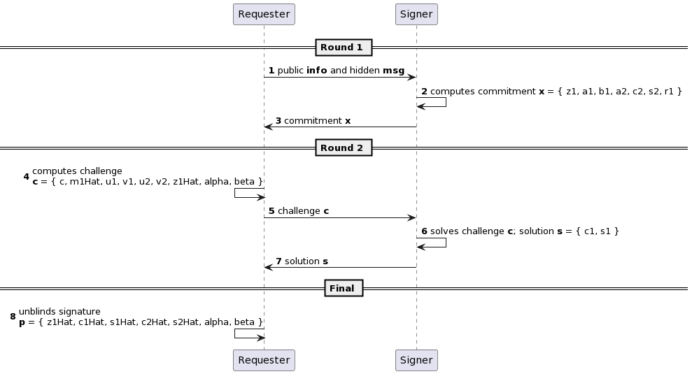

# RPBS Verifier Demo Project

This project demonstrates an RPBS Verifier. It comes with a sample contract, a test for that contract, and a script that deploys that contract.
RPBS stands for restrictive partially blind signatures. The contract allows to verify RPBS signatures onchain.

It uses these NPM Packages developed by Blockswap Labs:
1. [Off chain RPBS library](https://www.npmjs.com/package/@blockswaplab/blind-signer)
2. [On chain verification library](https://www.npmjs.com/package/@blockswaplab/rpbs-sol)

This scheme demonstrates the whole process:



Try running some of the following tasks:

Local network
```shell
yarn hardhat test
yarn hardhat deploy
```

Goerli network
```shell
yarn hardhat test --network goerli
yarn hardhat deploy --network goerli
```
